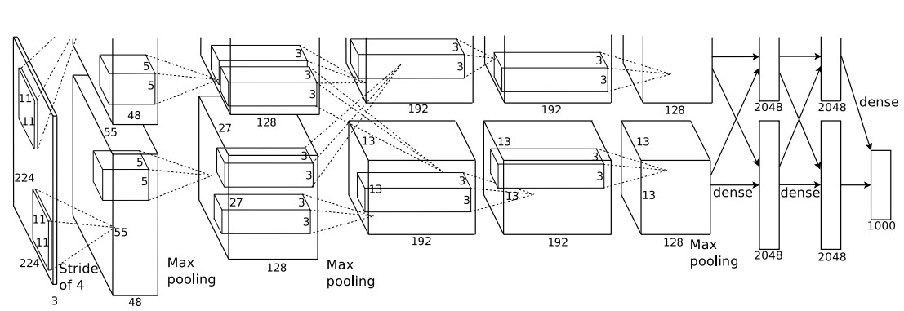

# AlexNet

ReLU Nonlinearity

The standard way to model a neuron’s output f as a function of its input x is with f(x) = tanh(x) or f(x) = (1 + e −x ) −1 . In terms of training time with gradient descent, these saturating nonlinearities are much slower than the non-saturating nonlinearity f(x) = max(0, x). 

 we refer to neurons with this nonlinearity as Rectified Linear Units (ReLUs). 

Deep convolutional neural networks with ReLUs train several times faster than their equivalents with tanh units. 

ReLUs have the desirable property that they do not require input normalization to prevent them from saturating. If at least some training examples produce a positive input to a ReLU, learning will happen in that neuron. 

verlapping Pooling Pooling layers in CNNs summarize the outputs of neighboring groups of neurons in the same kernel map. Traditionally, the neighborhoods summarized by adjacent pooling units do not overlap (e.g., [17, 11, 4]). To be more precise, a pooling layer can be thought of as consisting of a grid of pooling units spaced s pixels apart, each summarizing a neighborhood of size z × z centered at the location of the pooling unit.

Overall Architecture Now we are ready to describe the overall architecture of our CNN. As depicted in Figure 2, the net contains eight layers with weights; the first five are convolutional and the remaining three are fullyconnected. The output of the last fully-connected layer is fed to a 1000-way softmax which produces a distribution over the 1000 class labels. Our network maximizes the multinomial logistic regression objective, which is equivalent to maximizing the average across training cases of the log-probability of the correct label under the prediction distribution

The kernels of the second, fourth, and fifth convolutional layers are connected only to those kernel maps in the previous layer which reside on the same GPU (see Figure 2). The kernels of the third convolutional layer are connected to all kernel maps in the second layer. The neurons in the fullyconnected layers are connected to all neurons in the previous layer. Response-normalization layers follow the first and second convolutional layers. Max-pooling layers, of the kind described in Section 3.4, follow both response-normalization layers as well as the fifth convolutional layer. The ReLU non-linearity is applied to the output of every convolutional and fully-connected layer.

The first convolutional layer filters the 224×224×3 input image with 96 kernels of size 11×11×3 with a stride of 4 pixels (this is the distance between the receptive field centers of neighboring

neurons in a kernel map). The second convolutional layer takes as input the (response-normalized and pooled) output of the first convolutional layer and filters it with 256 kernels of size 5 × 5 × 48. The third, fourth, and fifth convolutional layers are connected to one another without any intervening pooling or normalization layers. The third convolutional layer has 384 kernels of size 3 × 3 × 256 connected to the (normalized, pooled) outputs of the second convolutional layer. The fourth convolutional layer has 384 kernels of size 3 × 3 × 192 , and the fifth convolutional layer has 256 kernels of size 3 × 3 × 192. The fully-connected layers have 4096 neurons each.

 Data Augmentation The easiest and most common method to reduce overfitting on image data is to artificially enlarge the dataset using label-preserving transformations (e.g., [25, 4, 5]). W

The first form of data augmentation consists of generating image translations and horizontal reflections. We do this by extracting random 224 × 224 patches (and their horizontal reflections) from the 256×256 images and training our network on these extracted patches4 . This increases the size of our training set by a factor of 2048, though the resulting training examples are, of course, highly interdependent. 

The second form of data augmentation consists of altering the intensities of the RGB channels in training images. Specifically, we perform PCA on the set of RGB pixel values throughout the ImageNet training set. To each training image, we add multiples of the found principal components

The second form of data augmentation consists of altering the intensities of the RGB channels in training images. Specifically, we perform PCA on the set of RGB pixel values throughout the ImageNet training set. To each training image, we add multiples of the found principal components

Dropout

recently-introduced technique, called “dropout” [10], consists of setting to zero the output of each hidden neuron with probability 0.5. The neurons which are “dropped out” in this way do not contribute to the forward pass and do not participate in backpropagation. So every time an input is presented, the neural network samples a different architecture, but all these architectures share weights. This technique reduces complex co-adaptations of neurons, since a neuron cannot rely on the presence of particular other neurons. It is, therefore, forced to learn more robust features that are useful in conjunction with many different random subsets of the other neurons. At test time, we use all the neurons but multiply their outputs by 0.5, which is a reasonable approximation to taking the geometric mean of the predictive distributions produced by the exponentially-many dropout networks.