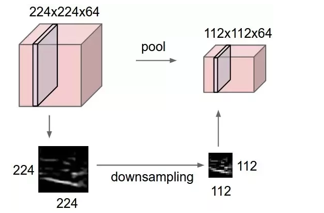

# AlexNet

In ordering to understand a little better the **AlexNet**    it is necessary understand a little better the building blocks of the network.  

This model was created by  **Alex Krizhevsky** , **Ilya Sutskever**  and **Geoffrey E. Hinton** at the University of Toronto . We will  highlight some parts of their [article](https://github.com/ruslanmv/Neural-Networks-from-Scratch/blob/master/Papers/2-%20AlexNet%20-%20Krizhevsky%20(2012)%20-%20ImageNet%20classification%20with%20deep%20convolutional%20neural%20networks.pdf) 

Let us first what we are talking about, an schematic picture of the Network is given by 

**Fig1. AlexNet Network Architecture** 

In the **Fig 1,** the net contains **eight layers** with **weights**; the first five are convolutional and the remaining three are **fullyconnected  layers** .

The output of the last fully-connected layer is fed to a 1000-way softmax which produces a distribution over the 1000 class labels. 

The kernels of the **second, fourth, and fifth convolutional layers** are connected only to those kernel maps in the previous layer which reside on the same GPU . 

The kernels of the **third convolutional layer** are connected to all kernel maps in the s**econd layer**. 

The neurons in the **fullyconnected layers** are connected to all neurons in the previous layer. Response-normalization layers follow the **first and second convolutional layers**. 

**Max-pooling layers**, follow both response-normalization layers as well as the **fifth convolutional layer**. The ReLU non-linearity is applied to the output of every convolutional and fully-connected layer.

The **first convolutional layer** filters the 224×224×3 input image with 96 kernels of size 11×11×3 with a stride of 4 pixels (this is the distance between the receptive field centers of neighboring neurons in a kernel map). 

The **second convolutional layer** takes as input the (response-normalized and pooled) output of the first convolutional layer and filters it with 256 kernels of size 5 × 5 × 48. 

The **third, fourth, and fifth convolutional layers** are connected to one another without any intervening pooling or normalization layers. 

The **third convolutional layer** has 384 kernels of size 3 × 3 × 256 connected to the (normalized, pooled) outputs of the second convolutional layer. 

The **fourth convolutional layer** has 384 kernels of size 3 × 3 × 192 , and the fifth convolutional layer has 256 kernels of size 3 × 3 × 192.

The **fully-connected layers** have 4096 neurons each.

## Understading the  architecture

Now that we have seen explicitly all the pieces of the Net, Let us talk about them.

You can visualize an schematic example of this net here

[https://ruslanmv.com/assets/tensorspace/data/models/alexnet/alexnet.html](https://ruslanmv.com/assets/tensorspace/data/models/alexnet/alexnet.html)

Let us consider just some components.

The convolutional layer in convolutional neural networks systematically applies filters to an input and creates output feature maps.

### **Stride**

Stride is a parameter of the neural network's filter that modifies the amount of movement over the image or video. Stride describes the process of increasing the step size by which you slide a filter over an input image. With a stride of 2, you advance the filter by two pixels at each step.

### Same Padding

Same padding is the procedure of adding enough pixels at the edges so that the resulting feature map has the same dimensions as the input image to the convolution operation

same padding for a 3×3 filter (left) and for a 5×5 filter (right)

### Maxpooling

 Formally, its function is to progressively reduce the spatial size of the representation to reduce the amount of parameters and computation in the network. 

Max pooling is done to in part to help over-fitting by providing an abstracted form of the representation. As well, it reduces the computational cost by reducing the number of parameters to learn and provides basic translation invariance to the internal representation. Max pooling is done by applying a max filter to (usually) non-overlapping subregions of the initial representation.

Let's say we have a 4x4 matrix representing our initial input. Let's say, as well, that we have a 2x2 filter that we'll run over our input. We'll have a **stride** of 2 (meaning the (dx, dy) for stepping over our input will be (2, 2)) and won't overlap regions.

For each of the regions represented by the filter, we will take the **max** of that region and create a new, output matrix where each element is the max of a region in the original input.

Pictorial representation: 

Real-life example: 

**ReLU Nonlinearity**

The standard way to model a neuron’s output f as a function of its input x is with f(x) = tanh(x) or f(x) = (1 + e −x ) −1 . In terms of training time with gradient descent, these saturating nonlinearities are much slower than the non-saturating nonlinearity f(x) = max(0, x). We refer to neurons with this nonlinearity as Rectified Linear Units (ReLUs). 

Deep convolutional neural networks with ReLUs train several times faster than their equivalents with tanh units. 

ReLUs have the desirable property that they do not require input normalization to prevent them from saturating. If at least some training examples produce a positive input to a ReLU, learning will happen in that neuron. 

**Overlapping Pooling Pooling layers** in CNNs summarize the outputs of neighboring groups of neurons in the same kernel map. Traditionally, the neighborhoods summarized by adjacent pooling units do not overlap.

To be more precise, a pooling layer can be thought of as consisting of a grid of pooling units spaced s pixels apart, each summarizing a neighborhood of size z × z centered at the location of the pooling unit.

 **Data Augmentation** .

The easiest and most common method to reduce overfitting on image data is to artificially enlarge the dataset using label-preserving transformations.

The first form of data augmentation consists of generating image translations and horizontal reflections. We do this by extracting random 224 × 224 patches (and their horizontal reflections) from the 256×256 images and training our network on these extracted patches . 

This increases the size of our training set by a factor of 2048, though the resulting training examples are, of course, highly interdependent. 

The second form of data augmentation consists of altering the intensities of the RGB channels in training images. Specifically, we perform PCA on the set of RGB pixel values throughout the ImageNet training set. To each training image, we add multiples of the found principal components

The second form of data augmentation consists of altering the intensities of the RGB channels in training images. Specifically, we perform PCA on the set of RGB pixel values throughout the ImageNet training set. [To](https://ruslanmv.com/) each training image, we add multiples of the found principal components

**Dropout**

Dropout consists of setting to zero the output of each hidden neuron with probability 0.5. 

The neurons which are “dropped out” in this way do not contribute to the forward pass and do not participate in backpropagation. 

So every time an input is presented, the neural network samples a different architecture, but all these architectures share weights. 

This technique reduces complex co-adaptations of neurons, since a neuron cannot rely on the presence of particular other neurons. It is, therefore, forced to learn more robust features that are useful in conjunction with many different random subsets of the other neurons. 

At test time, we use all the neurons but multiply their outputs by 0.5, which is a reasonable approximation to taking the geometric mean of the predictive distributions produced by the exponentially-many dropout networks.

For further  information about the elements of neural networks visit [this blog](https://ruslanmv.com/blog/Building-Blocks-of-Neural-Networks-and-TensorSpace).